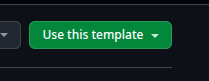

# ROS 2-PX4 Startup Template

[](https://docs.ros.org/en/jazzy/)
[](https://code.visualstudio.com/docs/devcontainers/containers)
[](https://docs.px4.io/)
[](docs/)

A comprehensive development container template for UAV controls and robotics research featuring ROS 2 Jazzy, PX4 SITL simulation, and pre-configured development tools.

## Features

- **ROS 2 Jazzy**: Full ROS 2 installation with development tools
- **PX4 Autopilot**: Latest PX4 firmware with SITL simulation capabilities
- **Micro-XRCE-DDS Agent**: Communication bridge between PX4 and ROS 2
- **Gazebo Integration**: `ros-jazzy-ros-gz` and `ros-jazzy-ros-gz-bridge` for simulation
- **Development Tools**: PlotJuggler, CMake, build tools, and debugging utilities
- **VS Code Extensions**: Pre-configured extensions for ROS, C++, Python, and Docker development

## Prerequisites

- Docker
- Visual Studio Code with Dev Containers extension
- X11 forwarding support (for GUI applications on Linux) or WSL2 (for Windows)

**Platform-specific installation guides:**

- [Linux Installation Guide](docs/linux-install.md)
- [Windows Installation Guide](docs/windows-install.md)

## Quick Start



1. Use this repository as a template to create your own project:

   ```bash
   # Option 1: Use GitHub's template feature (recommended)
   # Click "Use this template" button on GitHub, or

   # Option 2: Clone and start fresh
   git clone <repository-url> my-uav-project
   cd my-uav-project
   rm -rf .git
   git init
   ```

2. Open in VS Code:

   ```bash
   code .
   ```

3. When prompted, click "Reopen in Container" or use the Command Palette (`Ctrl+Shift+P`) and select "Dev Containers: Reopen in Container"

4. Wait for the container to build (first time may take 10-15 minutes)

## What's Included

### Software Stack

- **Base**: Ubuntu 24.04 with ROS 2 Jazzy
- **PX4 Autopilot**: Cloned from main branch with all dependencies
- **Micro-XRCE-DDS Agent**: Built and installed for PX4-ROS 2 communication
- **Gazebo**: ROS-Gazebo bridge for realistic simulation

### Development Tools

- Git, CMake, build-essential
- Python 3 with pip and setuptools
- PlotJuggler for data visualization
- FFmpeg for media processing
- Tree command for directory visualization

### VS Code Extensions

- ROS and Ament tools
- C++ and Python development
- Docker integration
- YAML, XML, and Markdown support
- URDF visualization
- CMake tools
- Code formatting (Uncrustify, Ruff)

## Container Configuration

### Workspace Structure

- **Container workspace**: `/workspaces/uav_control`
- **PX4 location**: `/workspaces/PX4-Autopilot`
- **Source code**: `/workspaces/uav_control/src` (copied from host `./src`)

### Networking & Display

- Host networking enabled for seamless ROS communication
- X11 forwarding for GUI applications
- Wayland display support
- Audio forwarding via PulseAudio

### Security & Permissions

- Runs as `ros` user (non-root)
- Privileged mode for hardware access
- USB device access for flight controllers
- Relaxed security for development

## Usage

### Building ROS Packages

```bash
cd /workspaces/uav_control
colcon build
source install/setup.bash
```

### Running PX4 SITL

```bash
cd /workspaces/PX4-Autopilot
make px4_sitl gazebo-classic
```

### Starting Micro-XRCE-DDS Agent

```bash
MicroXRCEAgent udp4 -p 8888
```

### Connecting to Hardware

USB devices are accessible within the container. Connect your flight controller and use standard PX4/ROS 2 workflows.

## Customization

### Adding ROS Packages

Place your ROS 2 packages in the `src/` directory before building the container, or add them later and rebuild using `colcon build`.

### Installing Additional Software

Modify the [Dockerfile](.devcontainer/Dockerfile) to add more packages or tools as needed.

### VS Code Settings

Customize the development environment by modifying the `customizations` section in [devcontainer.json](.devcontainer/devcontainer.json).

## Troubleshooting

For comprehensive troubleshooting and detailed configuration options, please refer to the official documentation links in the [References](#references) section below.

### Display Issues

If GUI applications don't work on Linux:

```bash
echo $DISPLAY
xhost +local:docker  # On host system
```

> **ℹ️ Note for Windows users**:
>
> - **Windows 11**: GUI forwarding is automatically handled by WSLg and no additional configuration is required.
>
> - **Windows 10**: Check if WSLg is available on your system, otherwise follow the X11 setup in the [Windows Installation Guide](docs/windows-install.md).

### Permission Issues

If you encounter permission errors:

```bash
sudo chown -R ros:ros /workspaces/uav_control
```

### PX4 Build Issues

Ensure you have enough disk space and memory. PX4 compilation requires significant resources.

## Planned Features

### ARM-based Device Support

Support for ARM-based devices is planned, including:

- Raspberry Pi (ARM64)
- NVIDIA Jetson devices (ARM64)
- Apple Silicon devices (M series)

## License

This project is licensed under the Apache License 2.0 - see the [LICENSE](LICENSE) file for details.

This project is developed by the [Stream Robotics group](https://sites.google.com/view/streamrobotics-polito/home) of Politecnico di Torino, Italy.

## Contributing

This repository serves as a template for UAV development projects. To contribute:

1. **Using as a Template**: Use GitHub's "Use this template" feature to create your own UAV project
2. **Contributing to the Template**:
   - Fork this repository
   - Create a feature branch
   - Make your changes to improve the template
   - Test in the development container
   - Submit a pull request

When contributing improvements to the template itself, ensure your changes benefit the general UAV development workflow and maintain compatibility across different projects.

## Acknowledgments

- [PX4 Autopilot](https://github.com/PX4/PX4-Autopilot) team
- [ROS 2](https://ros.org/) community
- [VS Code Dev Containers](https://code.visualstudio.com/docs/devcontainers/containers) documentation

## References

- **ROS 2 Documentation**: [docs.ros.org](https://docs.ros.org/) or directly [docs.ros.org/en/jazzy/](https://docs.ros.org/en/jazzy/)
- **PX4 User Guide**: [docs.px4.io](https://docs.px4.io/)
- **PX4-ROS 2 Integration**: [docs.px4.io/main/en/ros/ros2_comm](https://docs.px4.io/main/en/ros/ros2_comm.html)
- **VS Code Dev Containers**: [code.visualstudio.com/docs/devcontainers](https://code.visualstudio.com/docs/devcontainers/containers)
- **Micro-XRCE-DDS**: [micro-xrce-dds.docs.eprosima.com](https://micro-xrce-dds.docs.eprosima.com/)
